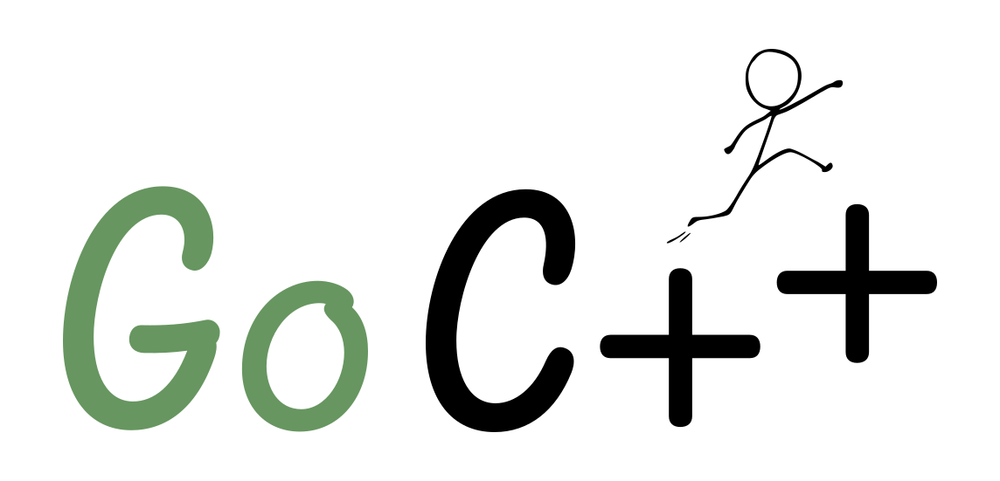

### Your quickstart to C++ projects

**[gocpp.dev]**

[gocpp.dev]: https://gocpp.dev

With a single command, Go C++ sets up:

- A CMake-based C++ project
- Package management using [CPM](https://github.com/cpm-cmake/CPM.cmake)
- Formatting using clang-format
- Compile-time checks using [Cppcheck](https://cppcheck.sourceforge.io/) and clang-tidy
- Code-hardening flags enabled, as recommended by the [OpenSSF](https://best.openssf.org/Compiler-Hardening-Guides/Compiler-Options-Hardening-Guide-for-C-and-C++.html)
- Flags that enable runtime memory error detection using AddressSanitizer

The generated project is cross-platform and uses a modern C++ standard.

Please see the [homepage](https://gocpp.dev) for a quick overview.
